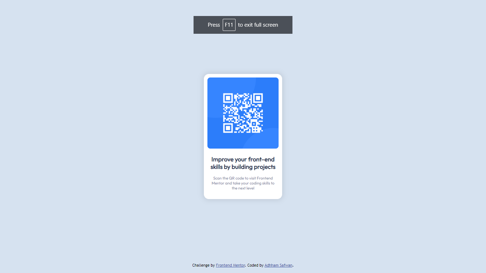

# Frontend Mentor - QR code component solution

This is a solution to the [QR code component challenge on Frontend Mentor](https://www.frontendmentor.io/challenges/qr-code-component-iux_sIO_H). Frontend Mentor challenges help you improve your coding skills by building realistic projects. 

## Table of contents

- [Overview](#overview)
  - [Screenshot](#screenshot)
  - [Links](#links)
  - [Built with](#built-with)
- [Author](#author)

**Note: Delete this note and update the table of contents based on what sections you keep.**

## Overview

This QR Code Component is created and designed by Adhham Safwan.

### Screenshot

### Links

- Solution URL: (https://github.com/adhhamdev/qr-code-component-main)
- Live Site URL: (https://adhhamdev.github.io/qr-code-component-main/)

### Built with

- Semantic HTML5 markup
- CSS custom properties
- Mobile-first workflow

**Note: These are just examples. Delete this note and replace the list above with your own choices**

## Author

- Website - (https://www.your-site.com)
- Frontend Mentor - [@adhhamdev](https://www.frontendmentor.io/profile/adhhamdev)
- Twitter - [@AdhhamDev](https://www.twitter.com/AdhhamDev)
